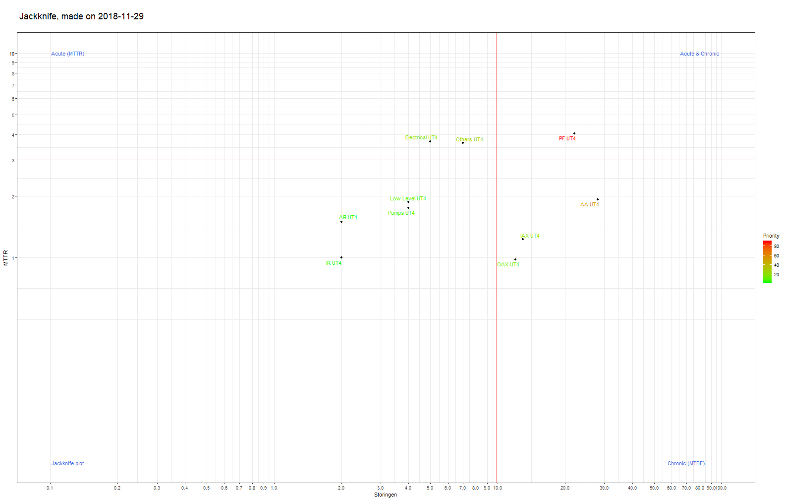

Jackknife
========================================================
author: Michel Marien
date: 28-11-218
autosize: true
font-family: 'Calibri'
transition: fade
transition-speed: slow

Introduction
========================================================
This assignment has two parts.

1. Create a Shiny application and deploy online.
2. Create a reproducible pitch presentation and deploy online.


Source code for ui.R and server.R is avaliable at:

https://github.com/Vosmeer/Course9Week4

Application is running at: 

https://mainformatics.shinyapps.io/jackknife_01/

Application features
========================================================
The application allows the user to prioritise maintenance activities by making a jackknife diagram based on the downtime per failure and the number of failures per component. The components with the highest priorities are displayed in shades of red

The user can upload his own data in .csv-format using the downloadable uploadsheet. 
Furthermore, it is possible to set an upper and lower limit on the time interval thus excluding datapoints based on failure date.

Finally it is also possible to look at an historic trend of the components by splitting the dataset in calender time intervals. 

Jaccknife plot (with example data)
========================================================
<font size="2">  

```r
library(ggrepel);library(grid);library(openxlsx);library(shiny);library(ggthemes)
library(lubridate);library(shinythemes);library(clipr);library(dplyr);library(stringr)
library(httpuv)

# Uploaden sample data (from github)

  url="https://raw.githubusercontent.com/Vosmeer/Course9Week4/master/Data_Jackknife_1.csv"
  JK_data <- read.csv(url,header = TRUE,sep = ";",dec = ",",stringsAsFactors = FALSE, quote = "")
  
  colnames(JK_data)<-c("No","Naam","Downtime","Datum")

# Date extraction from Date-column
  JK_data$Compleet<-"Ja"
  JK_data$Datum<-as.Date(JK_data$Datum,format="%d-%m-%Y")
  JK_data$Jaar<-format(year(JK_data$Datum),nsmall=0)
  JK_data$Week<-paste(JK_data$Jaar,format(week(JK_data$Datum),nsmall=0),sep="-")
  JK_data$Maand<-paste(JK_data$Jaar,format(month(JK_data$Datum),nsmall=0),sep="-")
  JK_data$Kwartaal<-paste(JK_data$Jaar,format(quarter(JK_data$Datum),nsmall=0),sep="-")

# Creating data summary to plot (removed are start/end-date and trend interval features)
  filter_naam<-"Naam"
  data<-JK_data
  JK_data_tr<-data%>% group_by_(filter_naam) %>% 
    summarise(Tot_downtime = sum(Downtime),Storingen=length(Naam), MTTR=mean(Downtime))  
  
# Creating JK plot
  ## Standard values
  MTBF_max<-ceiling(max(JK_data_tr$Storingen))
  MTBF_mean<-ceiling(mean(JK_data_tr$Storingen))
  
  uu<-seq(1,10,1)
  qq<-ceiling(log10(MTBF_max))+1
  tt<-uu[uu<=qq]
  dd<-c(1:9 %o% 10^tt)/(10^ceiling(log10(MTBF_max)))
  
  MTBF_axis<-c(dd,10^(qq-1))
  MTBF_limits<-c(0.1,10^ceiling(log10(MTBF_max)))
  
  MTTR_max<-ceiling(max(JK_data_tr$MTTR))
  MTTR_mean<-ceiling(mean(JK_data_tr$MTTR))
  
  uu<-seq(1,10,1)
  qq<-ceiling(log10(MTTR_max))+1
  tt<-uu[uu<=qq]
  dd<-c(1:9 %o% 10^tt)/(10^ceiling(log10(MTTR_max)))
  
  MTTR_axis<-c(dd,10^(qq-1))
  MTTR_limits<-c(0.1,10^ceiling(log10(MTTR_max)))
  
  ## Creating Plot
  jk_plot<-ggplot(data=JK_data_tr,aes(Storingen,MTTR,label=Naam,                                       group=Naam))+ geom_point()+
  geom_line(arrow = arrow(length=unit(0.30,"cm"), type = "closed"),aes(color=Storingen*MTTR))+
  scale_y_log10(limits=MTTR_limits,breaks=MTTR_axis)+
  scale_x_log10(limits=MTBF_limits,breaks=MTBF_axis)+
  geom_text_repel(aes(color=Storingen*MTTR)) +
  geom_hline(yintercept=MTTR_mean,color="red")+
  geom_vline(xintercept=sum(JK_data_tr$Storingen)/length(JK_data_tr$Storingen),color="red")+
  ggtitle(paste("\n Jackknife, made on ",Sys.Date(),"\n",sep=""))+
  annotate("text", 
      x = c(min(MTBF_limits)*1.2,min(MTBF_limits)*1.2,max(MTBF_limits)*0.7,max(MTBF_limits)*0.8),
      y = c(min(MTTR_limits),max(MTTR_limits),min(MTTR_limits),max(MTTR_limits)), 
      label = c("Jackknife plot", "Acute (MTTR)","Chronic (MTBF)","Acute & Chronic"),
      color="royalblue")+
    scale_color_gradient(low = "green",high = "red",name= "Priority")+
    theme_bw()+
    theme(plot.title=element_text(size=18)) 

  jk_plot
```
</font>
***
Below is an example Jackknife plot, created with the "Data_Jackknife_1.csv" dataset, located at https://github.com/Vosmeer/Course9Week4 



Check date in plot header to verify the dynamic nature of the plot!


The Application
========================================================
type: alert

  The application is generating a scatterplot, based on mean downtime and the number of failures.
  To use the application, the user should do the following:
  
  1. Upload data, using the downloadable uploadsheet (or use "Data_Jackknife_1.csv" in repository)
  2. Select the correct column separator and check the box if a header is included in the data
  3. Choose the date interval with the inputboxes Startdate and Enddate
  4. Select the trend interval for the data to be grouped in "Trendinterval". The possibilities are:
    - None
    - Year
    - Quarter
    - Month
    - Week
  5. Check the resulting data summary in the tab "Summary"
  6. Check the resulting Jackknife plot in the tab "Jackknife"
  7. After the Jackknife plot is configured, it can be downloaded using the downloadbutton


